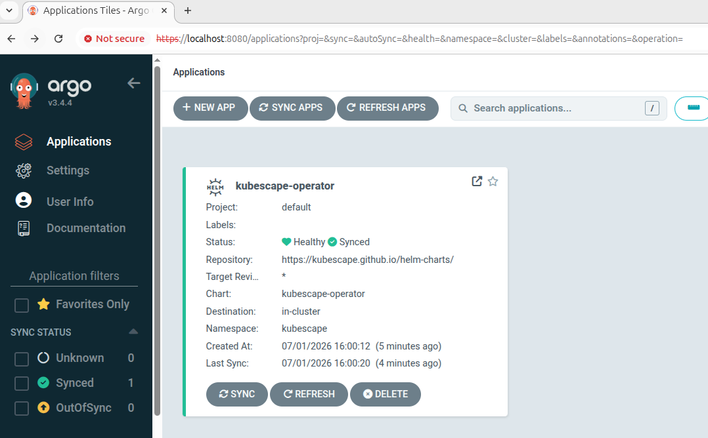

# Demo 2: Deploying Kubescape Operator via ArgoCD

This demo shows how to deploy the Kubescape Operator to a Kubernetes cluster using ArgoCD in self-hosted mode. Scan results are stored as CRDs inside the cluster.

## Prerequisites

- [Docker](https://docs.docker.com/engine/install/)
- [kind](https://kind.sigs.k8s.io/docs/user/quick-start/#installation)
- [kubectl](https://kubernetes.io/docs/tasks/tools/)
- [Helm](https://helm.sh/docs/intro/install/)

## Create a Cluster

```bash
kind create cluster --config kind/config.yaml
```

Verify:

```bash
kubectl get nodes
```

## Install ArgoCD

```bash
kubectl create namespace argocd
kubectl apply -n argocd -f https://raw.githubusercontent.com/argoproj/argo-cd/stable/manifests/install.yaml
```

Wait for ArgoCD to be ready:

```bash
kubectl wait --for=condition=available deployment -l app.kubernetes.io/name=argocd-server -n argocd --timeout=120s
```

## Access ArgoCD UI

Get the initial admin password:

```bash
kubectl -n argocd get secret argocd-initial-admin-secret -o jsonpath="{.data.password}" | base64 -d
```

Port-forward the ArgoCD server:

```bash
kubectl port-forward svc/argocd-server -n argocd 8080:443
```

Open https://localhost:8080 in your browser (accept the self-signed certificate warning).

- **Username:** `admin`
- **Password:** output from the command above

## Deploy Kubescape Operator via ArgoCD

Apply the ArgoCD Application manifest:

```bash
kubectl apply -f argocd/kubescape-operator.yaml
```

For more information, see [Kubescape Operator](https://kubescape.io/docs/install-operator/).

ArgoCD will pull the Kubescape Operator Helm chart and deploy it to the `kubescape` namespace automatically.

Monitor the sync status:

```bash
kubectl get application kubescape-operator -n argocd
```

Wait for all Kubescape pods to be running:

```bash
kubectl get pods -n kubescape
```

From ArgoCD UI you should see:



## Enabling Scanning Capabilities

### Defaults

The following capabilities are **enabled by default** when deploying the Kubescape Operator:

| Capability | Component | Description |
|---|---|---|
| `configurationScan` | `kubescape` deployment | Scans workloads against security frameworks (NSA, MITRE, CIS) |
| `vulnerabilityScan` | `kubevuln` deployment | Scans container images for CVEs using Grype engine |
| `nodeScan` | `node-agent` daemonset | Scans node-level config (kubelet, kernel, OS release) |
| `relevancy` | `node-agent` daemonset | Filters CVEs to only those relevant to running containers |

The following capabilities are **disabled by default**:

| Capability | Description |
|---|---|
| `continuousScan` | Continuously re-evaluates security posture on resource changes |
| `runtimeObservability` | eBPF-based observability of runtime behaviour |
| `runtimeDetection` | Real-time threat detection using eBPF |
| `networkPolicyService` | Generates network policies based on observed traffic |
| `malwareDetection` | Detects malware in running containers |
| `seccompProfileService` | Generates seccomp profiles from observed syscalls |
| `prometheusExporter` | Exposes scan metrics for Prometheus scraping |

### Custom Configuration

To enable different kind of scanning capabilities, create a separate Helm Chart's `values.yaml` file. For example:
```yaml
capabilities:
  # ====== configuration scanning related capabilities ======
  #
  # Default configuration scanning setup
  configurationScan: enable
  # Continuous Scanning continuously evaluates the security posture of your cluster.
  continuousScan: disable
  nodeScan: enable

  # ====== Image vulnerabilities scanning related capabilities ======
  #
  vulnerabilityScan: enable
  relevancy: enable
  # Generate VEX documents alongside the image vulnerabilities report (experimental)
  vexGeneration: disable

  # ====== Runtime related capabilities ======
  #
  runtimeObservability: enable
  networkPolicyService: enable
  runtimeDetection: disable
  malwareDetection: disable
  nodeProfileService: disable
  seccompProfileService: enable

  # ====== Other capabilities ======
  #
  # This is an experimental capability with an elevated security risk. Read the
  # matching docs before enabling.
  autoUpgrading: disable
  prometheusExporter: disable
  # seccompGenerator: disable

#extra capability - service discovery option
serviceScanConfig:
  enabled : false
  interval: 1h
```

For more information, see [Enabling capabilities](https://kubescape.io/docs/install-operator/#configuring-your-installation:~:text=detailed%20configuration%20options.-,Enabling%20capabilities,-High%2Dlevel%20capabilities).

## Trigger a Manual Scan

By default the operator scans on a daily schedule (`cronjob/kubescape-scheduler`). To trigger a scan immediately, create a Job from the CronJob:

```bash
kubectl create job --from=cronjob/kubescape-scheduler manual-scan -n kubescape
```

Watch the scan pod run:

```bash
kubectl get pods -n kubescape -w
```

## View Scan Results

Results are stored as Kubernetes CRDs:

```bash
# Vulnerability scan results
kubectl get vulnerabilitymanifestsummaries -n kubescape

# Service/network scan results
kubectl get servicesscanresults -n kubescape

# View full details of a specific vulnerability result
kubectl describe vulnerabilitymanifestsummary <name> -n kubescape
```

## Generate Reports with Kubescape CLI

Once the operator is running, use the Kubescape CLI to scan the live cluster and generate reports in various formats.

Scan and print to terminal:

```bash
kubescape scan
```

Generate a PDF report:

```bash
kubescape scan --format pdf --output kubescape-report.pdf
```

Generate an HTML report:

```bash
kubescape scan --format html --output kubescape-report.html
```

Scan a specific framework and export:

```bash
kubescape scan framework nsa --format pdf --output nsa-report.pdf
```

## Cleanup

```bash
kind delete cluster --name kubescape-operator-demo
```
