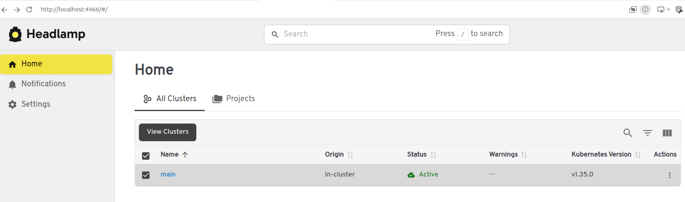
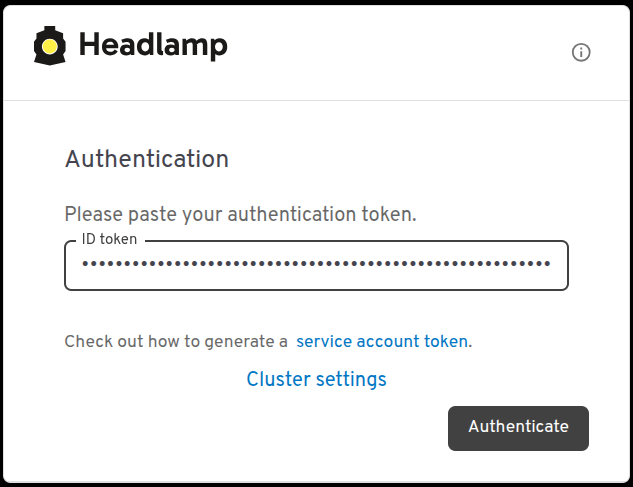
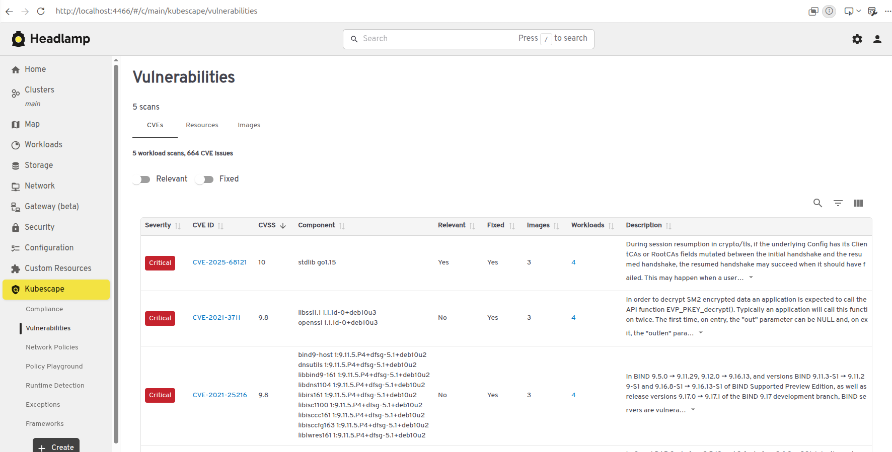

# Demo 3: Headlamp Dashboard for Kubescape

This demo shows how to install the Headlamp dashboard with the Kubescape plugin to visualize security scan results in a UI.

## Prerequisites

- [Docker](https://docs.docker.com/engine/install/)
- [kind](https://kind.sigs.k8s.io/docs/user/quick-start/#installation)
- [kubectl](https://kubernetes.io/docs/tasks/tools/)
- [Helm](https://helm.sh/docs/intro/install/)

## Create a Cluster

```bash
kind create cluster --config kind/config.yaml
```

Verify:

```bash
kubectl get nodes
```

## Install Kubescape Operator

Add the Kubescape Helm repository:

```bash
helm repo add kubescape https://kubescape.github.io/helm-charts/
helm repo update
```

> [!IMPORTANT] 
> When installing Kubescape make sure you enable **continuousScan** `--set capabilities.continuousScan=enable`  
> and **network observability** `--set capabilities.networkPolicyService=enable`.  
> This is requirement for Headlamp UI installation.    

Install the operator with `continuousScan` and `networkPolicyService` enabled:

```bash
helm install kubescape kubescape/kubescape-operator \
  --namespace kubescape \
  --create-namespace \
  -f kubescape/values.yaml
```

Wait for all pods to be ready:

```bash
kubectl get pods -n kubescape -w
```

## Install Headlamp

Add the Headlamp Helm repository:

```bash
helm repo add headlamp https://kubernetes-sigs.github.io/headlamp/
helm repo update
```

Install Headlamp with the Kubescape plugin:

```bash
helm install my-headlamp headlamp/headlamp \
  --namespace kube-system \
  -f headlamp/values.yaml
```

Wait for Headlamp to be ready:

```bash
kubectl get pods -n kube-system -l app.kubernetes.io/name=headlamp
```

## Access Headlamp UI

Port-forward the Headlamp service:

```bash
kubectl port-forward svc/my-headlamp -n kube-system 4466:80
```

Open http://localhost:4466 in your browser.



To log in, generate a service account token:

1. Create a Service Account:
```bash
kubectl -n kube-system create serviceaccount headlamp-admin
```
2. Give admin rights to the account:
```bash
kubectl create clusterrolebinding headlamp-admin --serviceaccount=kube-system:headlamp-admin --clusterrole=cluster-admin
```
3. Create the token for Kubernetes `v1.24+`:
```bash
kubectl create token headlamp-admin -n kube-system
```
4. Copy the token and log in:



For more information, see [Create a Service Account token](https://headlamp.dev/docs/latest/installation/#create-a-service-account-token).


## Trigger Scans

By default the operator scans on a daily schedule. To see results immediately, trigger both scan types manually:

```bash
# Configuration scan (compliance / security posture)
kubectl create job --from=cronjob/kubescape-scheduler manual-scan -n kubescape

# Vulnerability scan (image CVEs)
kubectl create job --from=cronjob/kubevuln-scheduler manual-vuln-scan -n kubescape
```

Watch the scan jobs complete:

```bash
kubectl get pods -n kubescape -w
```

Once the pods reach `Completed`, **refresh the browser** — the Kubescape plugin does not auto-update and requires a manual refresh to display new results.



## Cleanup

```bash
kind delete cluster --name kubescape-headlamp-demo
```

## References
- [Introducing a Visual Way to Explore Kubernetes Security: the Kubescape Plugin for Headlamp
](https://kubescape.io/blog/2025/04/30/kubescape-headlamp/)
- [Headlamp In-cluster Installation](https://headlamp.dev/docs/latest/installation/in-cluster/)
- [Kubescape Headlamp Plugin: github.com/kubescape/headlamp-plugin/](https://github.com/kubescape/headlamp-plugin/)
