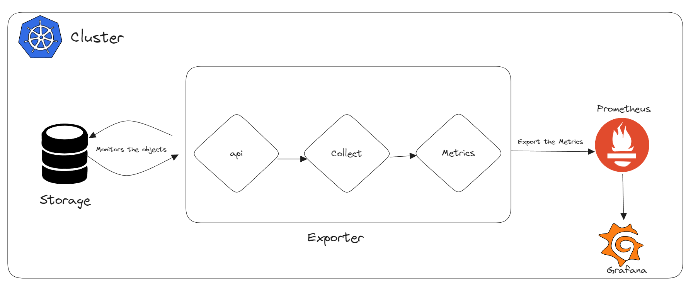
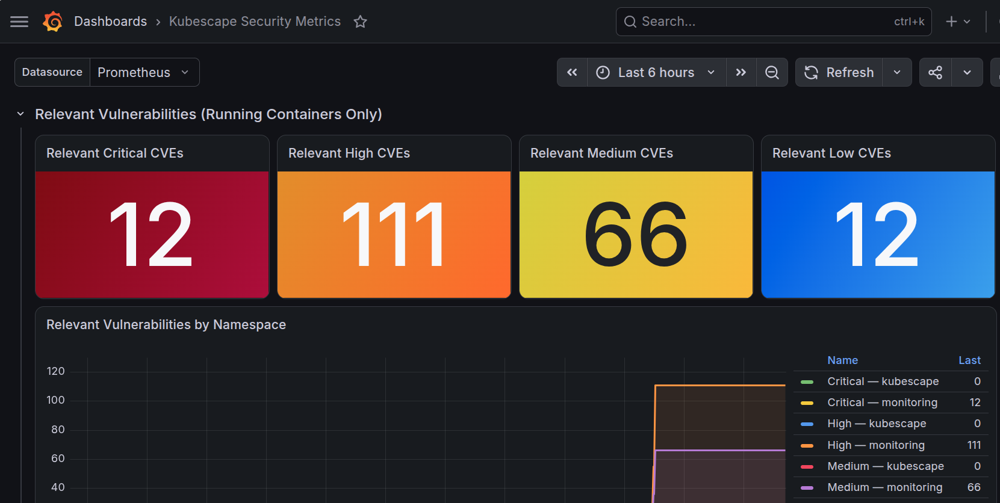

# Prometheus Exporter with Kubescape

This demo shows how to export Kubescape security metrics to Prometheus and visualize them in Grafana.



## Prerequisites

- [Docker](https://docs.docker.com/engine/install/)
- [kind](https://kind.sigs.k8s.io/docs/user/quick-start/#installation)
- [kubectl](https://kubernetes.io/docs/tasks/tools/)
- [Helm](https://helm.sh/docs/intro/install/)

## Create a Cluster

```bash
kind create cluster --config kind/config.yaml
```

Verify:

```bash
kubectl get nodes
```

## Install Kubescape Operator

```bash
helm repo add kubescape https://kubescape.github.io/helm-charts/
helm repo update

helm install kubescape kubescape/kubescape-operator \
  --namespace kubescape \
  --create-namespace \
  -f kubescape/values.yaml
```

Wait for all pods to be ready:

```bash
kubectl get pods -n kubescape -w
```

## Trigger a Scan

```bash
kubectl create job --from=cronjob/kubescape-scheduler manual-scan -n kubescape
kubectl create job --from=cronjob/kubevuln-scheduler manual-vuln-scan -n kubescape
```

Verify metrics are being exposed:

```bash
kubectl port-forward svc/prometheus-exporter -n kubescape 8080:8080
curl http://localhost:8080/metrics
```

## Install Prometheus and Grafana

Install [`kube-prometheus-stack`](https://artifacthub.io/packages/helm/prometheus-community/kube-prometheus-stack) which bundles Prometheus, Grafana and Alertmanager:

```bash
helm repo add prometheus-community https://prometheus-community.github.io/helm-charts
helm repo update

helm install kube-prometheus-stack prometheus-community/kube-prometheus-stack \
  --namespace monitoring \
  --create-namespace \
  -f prometheus/values.yaml
```

Wait for all pods to be ready:

```bash
kubectl get pods -n monitoring -w
```

## Access Grafana

Port-forward the Grafana service:

```bash
kubectl port-forward svc/kube-prometheus-stack-grafana -n monitoring 3000:80
```

Open http://localhost:3000 in your browser.

- **Username:** `admin`
- **Password:** `admin`

## Import Kubescape Dashboard

1. In Grafana, go to **Dashboards --> Import**
2. Click **Upload dashboard JSON file**
3. Select `grafana/kubescape-dashboard.json`
4. Select the Prometheus datasource
5. Click **Import**

The dashboard includes three sections:
- **Security Controls** — misconfiguration counts by severity with a trend graph
- **Total Vulnerabilities** — all CVEs found across all images
- **Relevant Vulnerabilities** — CVEs in actively running containers, broken down by namespace



## Cleanup

```bash
kind delete cluster --name kubescape-metrics-demo
```

## References
- [GitHub Kubescape Prometheus Exporter](https://github.com/kubescape/prometheus-exporter)
